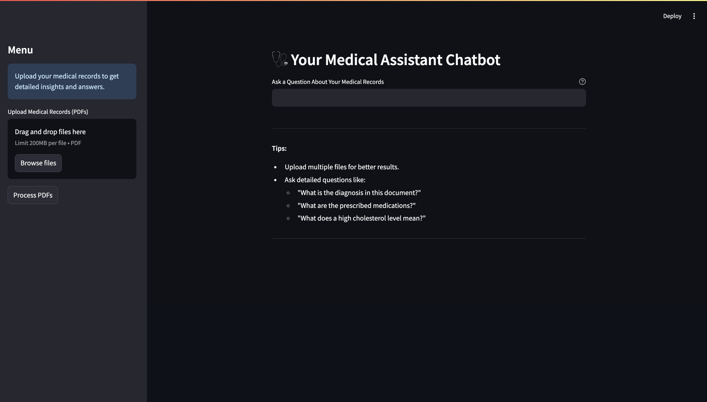
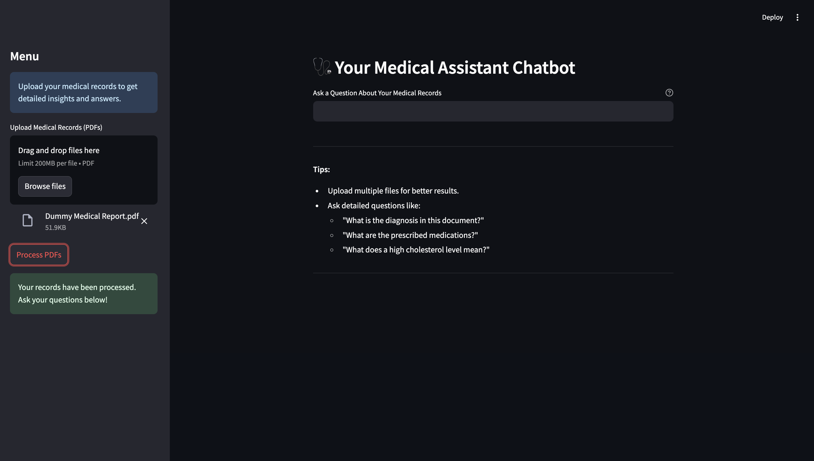
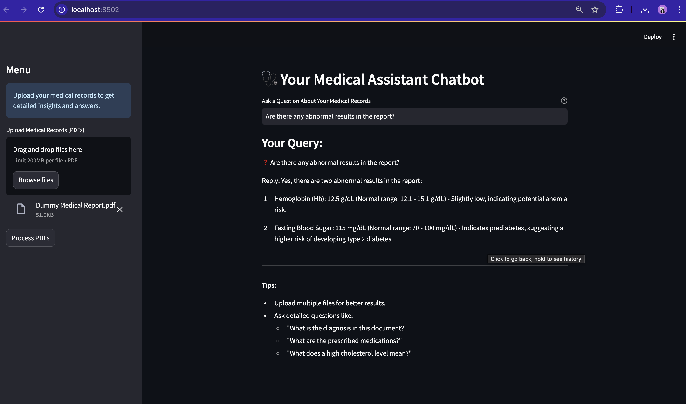

# Medical Report Assistant Bot 🩺

This project is designed to help patients understand their medical reports by leveraging advanced NLP (RAG) techniques. Medical reports often contain complex terminology and detailed information that can be difficult for the average patient to interpret. This bot simplifies the process by allowing users to upload their medical PDFs and interactively query the content through a Streamlit-powered web application.

---
 
## Demo Screenshots





---

## Features

- **PDF Upload and Processing**: Supports uploading single or multiple medical reports for analysis.
- **Text Chunking and Indexing**: Splits text into manageable chunks and builds a vectorized index using FAISS for fast and accurate search.
- **Interactive Querying**: Allows users to ask questions like:
  - "What is my diagnosis?"
  - "What does a high cholesterol level mean?"
  - "What medications have been prescribed?"
- **Google Generative AI Integration**: Utilizes `Gemini Pro` and `embedding-001` models for text embeddings and conversational AI, ensuring accurate and detailed medical explanations.

---

## How This Bot Can Help

Medical reports often use highly technical terms that can confuse non-medical individuals. This bot bridges the gap by:
1. Providing **clear explanations** of test results, diagnoses, and prescribed treatments.
2. Helping patients **make sense of complex data** like lab test values, ranges, and medication lists.
3. Offering **personalized insights** through interactive Q&A, tailored to the user’s medical documents.

By empowering patients with knowledge about their health, this bot promotes better understanding and informed decision-making.

---

## Methodology

### 1. **Backend Workflow**
- **PDF Processing**:
  - Extracts text from uploaded medical PDF files using `PyPDF2`.
  - Splits the text into smaller chunks using `RecursiveCharacterTextSplitter` for efficient indexing and retrieval.
- **Embedding and Vector Storage**:
  - Generates vector embeddings for text using Google Generative AI models.
  - Builds and saves a FAISS vector index for similarity search, enabling accurate question answering.
- **Conversational AI**:
  - Integrates a custom prompt with the `Gemini Pro` model for precise and contextual responses.
  - Handles user questions by searching the FAISS index and generating responses from the most relevant text chunks.

### 2. **Frontend Workflow**
- Built using Streamlit:
  - A user-friendly interface with options to upload and process PDFs.
  - Sidebar for managing files and processing them interactively.
  - Input field for querying the content of the uploaded PDFs.

---

## Installation

### Prerequisites
- Python 3.8 or higher
- Required dependencies (`pip install -r requirements.txt`)

### Steps
1. Clone the repository:
   ```bash
   git clone https://github.com/rajdip-i/Medical-Report-Assistant-Bot.git
   cd Medical-Report-Assistant-Bot
   ```

2. Install dependencies:
   ```bash
   pip install -r requirements.txt
   ```

3. Add your Google Generative AI API key to a `.env` file:
   ```env
   GOOGLE_API_KEY=YOUR_API_KEY
   ```

4. Run the application:
   ```bash
   streamlit run app.py
   ```

---

## Usage

1. **Upload PDFs**: Add one or more medical reports via the upload feature.
2. **Process PDFs**: Click the "Process PDFs" button to extract text and build the FAISS index.
3. **Ask Questions**: Use the input box to ask questions about the content of the uploaded medical reports.
4. **Receive Insights**: Get detailed and accurate answers from your reports.

---

## Example Questions

- "What is my blood pressure reading?"
- "What does a high cholesterol level mean?"
- "Are there any abnormal results in the report?"
- "What medications have been prescribed?"
- "What are the normal ranges for these test results?"

---

## Technologies Used

- **Streamlit**: For the frontend interface.
- **PyPDF2**: For extracting text from PDF files.
- **FAISS**: For text chunk indexing and similarity search.
- **Google Generative AI**: For generating embeddings (`embedding-001`) and conversational AI (`Gemini Pro`).
- **LangChain**: For building and managing the conversational pipeline.

---

